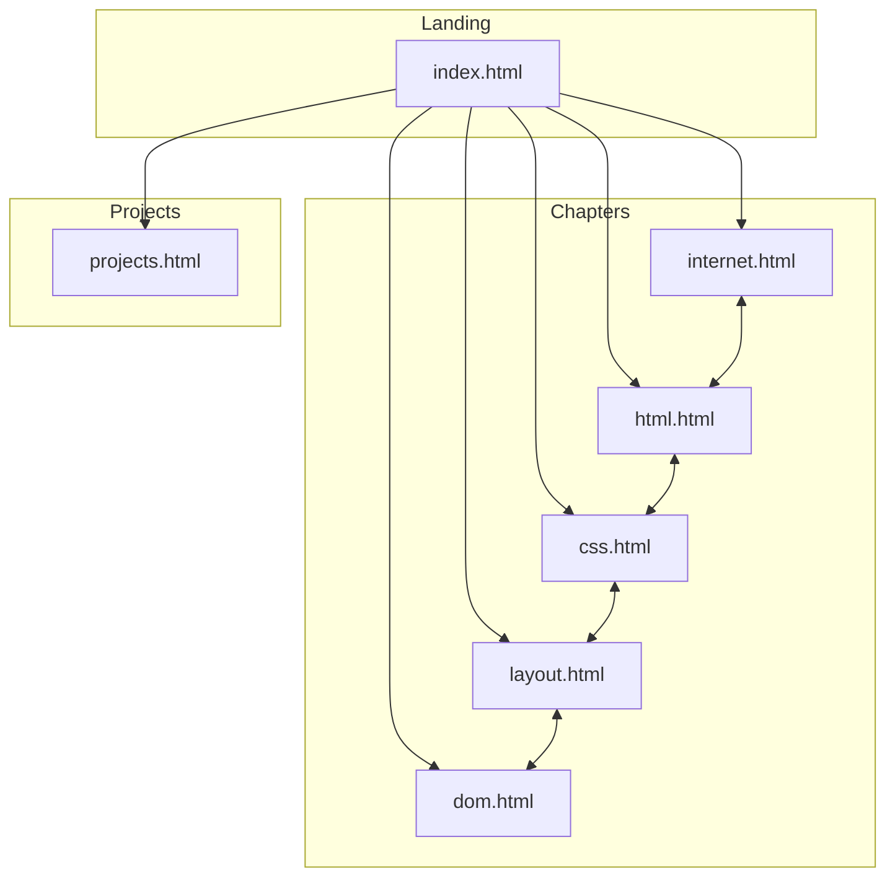

# WebDev Academy - Project Documentation

> **A comprehensive, interactive web development fundamentals course built with HTML, CSS, and JavaScript.**

---

## Table of Contents

1. [Project Overview](#project-overview)
2. [Project Structure](#project-structure)
3. [Technology Stack](#technology-stack)
4. [Architecture](#architecture)
5. [Pages & Features](#pages--features)
6. [JavaScript Application](#javascript-application)
7. [Styling System](#styling-system)
8. [Course Content](#course-content)
9. [How to Run](#how-to-run)
10. [Future Enhancements](#future-enhancements)

---

## Project Overview

**WebDev Academy** is a self-paced, interactive web development course that teaches fundamental web technologies through lessons, quizzes, and hands-on exercises. The course is designed as a multi-page static website with persistent progress tracking.

### Key Features

- 📚 **5 Comprehensive Chapters** covering Internet basics, HTML, CSS, Layout (Flexbox/Grid), and the DOM
- ✅ **Interactive Quizzes** with immediate feedback and correct answer highlighting
- 💻 **Code Exercises** with live HTML/CSS/JavaScript preview
- 📊 **Progress Tracking** persisted via localStorage across sessions
- 🎨 **Modern UI** with dark theme, gradient accents, and smooth animations
- 📱 **Responsive Design** works on mobile, tablet, and desktop
- 🔗 **Multi-Page Architecture** with consistent navigation across pages

---

## Project Structure

```
WebDev_Academy/
├── index.html              # Landing page with chapter cards
├── projects.html           # Practice projects page
├── styles.css              # Global stylesheet (1038 lines)
├── app.js                  # Application logic (445 lines)
├── chapters/               # Individual chapter pages
│   ├── internet.html       # Chapter 1: The Internet & WWW
│   ├── html.html           # Chapter 2: HTML Structure
│   ├── css.html            # Chapter 3: CSS Styling
│   ├── layout.html         # Chapter 4: Flexbox & Grid
│   └── dom.html            # Chapter 5: The DOM
├── js_matirial/            # (Excluded from documentation)
└── .git/                   # Git repository
```

### File Size Overview

| File | Size | Purpose |
|------|------|---------|
| `styles.css` | ~22 KB | Complete design system and component styles |
| `app.js` | ~14 KB | Interactivity, progress tracking, quiz logic |
| `index.html` | ~6 KB | Landing page with chapter navigation |
| `projects.html` | ~6 KB | Practice projects with step-by-step guides |
| `css.html` | ~97 KB | Largest chapter (comprehensive CSS coverage) |
| `html.html` | ~77 KB | HTML fundamentals with examples |
| `dom.html` | ~51 KB | DOM manipulation and browser APIs |
| `layout.html` | ~41 KB | Flexbox, Grid, and responsive design |
| `internet.html` | ~29 KB | How the web works |

---

## Technology Stack

### Core Technologies

| Technology | Usage |
|------------|-------|
| **HTML5** | Semantic structure, forms, accessibility |
| **CSS3** | Custom properties, Flexbox, Grid, animations |
| **Vanilla JavaScript** | ES6+, DOM manipulation, localStorage |
| **Google Fonts** | Inter (body), Fira Code (code blocks) |

### No Build Tools Required

This project is a pure static site with no:
- Package managers (npm, yarn)
- Bundlers (webpack, vite)
- Preprocessors (SASS, TypeScript)
- Frameworks (React, Vue)

Simply open `index.html` or run a local server.

---

## Architecture

### Multi-Page Structure



### Data Flow

```
┌─────────────────────────────────────────────────────────┐
│                    Browser Storage                       │
│  ┌─────────────────────────────────────────────────────┐│
│  │ localStorage["webdev-academy-progress"]             ││
│  │ {                                                    ││
│  │   "internet": ["quiz-internet-1", "quiz-internet-2"],││
│  │   "html": ["quiz-html-1", "exercise-html-ex-1"],    ││
│  │   ...                                                ││
│  │ }                                                    ││
│  └─────────────────────────────────────────────────────┘│
└─────────────────────────────────────────────────────────┘
                           │
                           ▼
┌─────────────────────────────────────────────────────────┐
│                     app.js                               │
│  ┌──────────────┐  ┌──────────────┐  ┌──────────────┐  │
│  │ state.       │  │ checkQuiz()  │  │ runHTMLCode()│  │
│  │ markComplete │  │              │  │ runJSCode()  │  │
│  │ isComplete   │  │              │  │ runCSSCode() │  │
│  └──────────────┘  └──────────────┘  └──────────────┘  │
└─────────────────────────────────────────────────────────┘
                           │
                           ▼
┌─────────────────────────────────────────────────────────┐
│                       UI Updates                         │
│  • Progress bar percentage                               │
│  • Chapter status dots (Not started/In progress/Done)   │
│  • Quiz answer highlighting                              │
└─────────────────────────────────────────────────────────┘
```

---

## Pages & Features

### 1. Landing Page (`index.html`)

**Purpose**: Course entry point with chapter overview and global progress.

**Key Components**:
- **Hero Section**: Course title, description, progress bar
- **Chapter Cards**: 6 clickable cards linking to chapters + projects
- **Status Indicators**: Visual dots showing completion state per chapter

**HTML Structure**:
```html
<section class="hero">
    <h1>Web Development Fundamentals</h1>
    <div class="progress-bar">
        <div class="progress-fill" id="progressFill"></div>
        <div class="progress-text">Course Progress: <span id="progressPercent">0</span>%</div>
    </div>
</section>

<section class="chapter-cards">
    <a href="chapters/internet.html" class="chapter-card" data-chapter="internet">
        <span class="chapter-icon">🌐</span>
        <div class="chapter-card-content">
            <h3>Chapter 1: The Internet</h3>
            <p>Learn how the web works...</p>
            <span class="chapter-status">
                <span class="status-dot" id="status-internet"></span>
                <span class="status-text" id="status-text-internet">Not started</span>
            </span>
        </div>
    </a>
    <!-- More chapter cards... -->
</section>
```

---

### 2. Chapter Pages (`chapters/*.html`)

**Common Structure**:
```html
<nav><!-- Consistent navigation --></nav>
<div class="breadcrumb">Home › Chapter X: Title</div>
<main>
    <article class="chapter-page" data-chapter="chapterId">
        <header class="chapter-page-header">
            <span class="chapter-icon">🌐</span>
            <h1>Chapter Title</h1>
        </header>
        <div class="chapter-inner">
            <div class="lesson"><!-- Lesson content --></div>
            <div class="quiz" data-correct="b" data-quiz-id="unique-id">
                <!-- Quiz questions -->
            </div>
            <div class="exercise"><!-- Interactive exercise --></div>
        </div>
    </article>
</main>
<footer><!-- Course info --></footer>
```

#### Chapter 1: The Internet (`internet.html`)

**Content**:
- 1.1 What is the Internet? (History, components, services)
- 1.2 Internet vs. World Wide Web
- 1.3 How Web Communication Works (Client-server model, HTTP)
- 1.4 URLs and Domain Names
- 1.5 HTTP Methods (GET, POST, etc.)
- 1.6 HTTP Response Status Codes

**Interactive Elements**:
- 4 quizzes (no exercises)

---

#### Chapter 2: HTML (`html.html`)

**Content**:
- 2.1 What is HTML? (Document structure, DOCTYPE, head, body)
- 2.2 Block vs Inline Elements
- 2.3 Text Elements (Headings, paragraphs)
- 2.4 Text Formatting
- 2.5 Links and Navigation
- 2.6 Lists
- 2.7 Images and Media
- 2.8 Tables
- 2.9 Forms and User Input
- 2.10 Semantic HTML5 Elements

**Interactive Elements**:
- 2 quizzes
- 2 HTML exercises with live preview

---

#### Chapter 3: CSS (`css.html`)

**Content**:
- 3.1 What is CSS? (Syntax, cascade, methods of adding CSS)
- 3.2 CSS Selectors (Basic, combinators, attribute, pseudo-classes/elements, specificity)
- 3.3 CSS Colors (Named, hex, RGB/RGBA, HSL/HSLA)
- 3.4 CSS Typography (Font families, sizing, weight, text properties)
- 3.5 The CSS Box Model (Content, padding, border, margin)

**Interactive Elements**:
- 2 quizzes
- 2 CSS exercises

---

#### Chapter 4: Layout (`layout.html`)

**Content**:
- 4.1 The Display Property
- 4.2 Position Property (static, relative, absolute, fixed, sticky)
- 4.3 Float Property
- 4.4 Flexbox Layout (Container/item properties, common patterns)
- 4.5 CSS Grid Layout (Template columns/rows, areas, item placement)
- 4.6 Responsive Design (Media queries, mobile-first)
- 4.7 CSS Transitions and Transforms
- 4.8 CSS Variables

**Interactive Elements**:
- 3 quizzes
- 2 layout exercises

---

#### Chapter 5: The DOM (`dom.html`)

**Content**:
- 5.1 Global DOM Objects (window, document, location, navigator, screen, history)
- 5.1.2 Unobtrusive JavaScript
- 5.2 DOM Element Objects (innerHTML, textContent, value, styles, classList)
- 5.3 The DOM Tree (Node types, traversal, selecting groups, creating/removing nodes)
- 5.3.2 Browser DevTools

**Interactive Elements**:
- 4 quizzes
- 2 JavaScript exercises with live execution

---

### 3. Projects Page (`projects.html`)

**Purpose**: Hands-on projects to practice learned skills.

**Projects Included**:

| Project | Difficulty | Description |
|---------|------------|-------------|
| Personal Portfolio | ⭐☆☆ | Portfolio page with header, navigation, about, skills sections |
| Product Card | ⭐⭐☆ | Reusable e-commerce product card with hover effects |
| Responsive Blog | ⭐⭐⭐ | Full blog layout with Grid, sidebar, media queries |

Each project includes step-by-step instructions.

---

## JavaScript Application

### `app.js` Overview

The JavaScript application handles all interactivity and state management.

### Configuration (`CONFIG`)

```javascript
const CONFIG = {
  storageKey: 'webdev-academy-progress',
  copyFeedbackDuration: 2000, // ms
  chapters: {
    internet: { quizzes: 4, exercises: 0 },
    html: { quizzes: 2, exercises: 2 },
    css: { quizzes: 2, exercises: 2 },
    layout: { quizzes: 3, exercises: 2 },
    dom: { quizzes: 4, exercises: 2 },
    projects: { quizzes: 0, exercises: 0 },
  },
};
// Total: 15 quizzes + 8 exercises = 23 trackable items
```

### State Management (`state`)

| Method | Description |
|--------|-------------|
| `getCompletedItems()` | Returns object with completed items per chapter |
| `markComplete(chapterId, itemId)` | Marks item complete, returns `true` if newly completed |
| `isComplete(chapterId, itemId)` | Checks if item already completed |
| `getTotalCompleted()` | Returns total completed count across all chapters |
| `getChapterCompleted(chapterId)` | Returns completed count for specific chapter |

**Storage Format**:
```json
{
  "internet": ["quiz-internet-1", "quiz-internet-2"],
  "html": ["quiz-html-1", "exercise-html-ex-1"],
  "css": ["quiz-css-1"],
  "layout": [],
  "dom": []
}
```

### Core Functions

| Function | Purpose |
|----------|---------|
| `updateProgress()` | Updates progress bar width and percentage |
| `updateChapterStatuses()` | Updates status dots on landing page |
| `checkQuiz(option, selected)` | Validates quiz answer, shows feedback |
| `runHTMLCode(textareaId, outputId)` | Renders HTML from textarea to preview |
| `runJSCode(textareaId, outputId)` | Executes JavaScript with error handling |
| `runCSSCode(textareaId, outputId)` | Injects CSS into page dynamically |
| `showHint(hintId)` | Toggles hint visibility |
| `copyCode(btn)` | Copies code block to clipboard |
| `highlightActiveNav()` | Highlights current page in navigation |
| `restoreQuizStates()` | Restores answered quizzes on page load |

### DOM Utilities

```javascript
const $ = (selector, parent = document) => parent.querySelector(selector);
const $$ = (selector, parent = document) => parent.querySelectorAll(selector);
```

---

## Styling System

### CSS Custom Properties (Design Tokens)

Located in `:root` selector in `styles.css`:

```css
:root {
    /* Colors */
    --bg-dark: #0f0f1a;
    --bg-card: #1a1a2e;
    --bg-code: #0d0d1a;
    --color-primary: #6366f1;      /* Indigo */
    --color-secondary: #8b5cf6;    /* Purple */
    --color-success: #22c55e;      /* Green */
    --color-error: #ef4444;        /* Red */
    
    /* Typography */
    --font-main: 'Inter', -apple-system, sans-serif;
    --font-code: 'Fira Code', monospace;
    
    /* Spacing */
    --spacing-xs: 4px;
    --spacing-sm: 8px;
    --spacing-md: 16px;
    --spacing-lg: 24px;
    --spacing-xl: 32px;
    
    /* Border Radius */
    --radius-sm: 4px;
    --radius-md: 8px;
    --radius-lg: 12px;
    --radius-xl: 16px;
    
    /* Transitions */
    --transition-fast: 0.2s ease;
    --transition-base: 0.3s ease;
    
    /* Layout */
    --max-width-content: 1200px;
    --max-width-nav: 1400px;
}
```

### CSS Architecture

The stylesheet is organized into 16+ sections:

1. **CSS Custom Properties** - Design tokens
2. **CSS Reset & Base Styles** - Normalize defaults
3. **Navigation** - Fixed navbar with gradient logo
4. **Hero Section** - Progress bar
5. **Main Content Layout** - Max-width container
6. **Chapter Sections** - Accordion-style chapters
7. **Lessons** - Content styling
8. **Code Blocks** - Syntax-highlighted examples
9. **Interactive Exercises** - Textarea + output
10. **Feedback Messages** - Success/error states
11. **Quizzes** - Option cards with states
12. **Project Cards** - Difficulty indicators
13. **Footer** - Minimal footer
14. **Animations** - Fade-in keyframes
15. **Responsive Design** - Media queries
16. **Chapter Cards** - Landing page grid

### Component Classes

| Class | Purpose |
|-------|---------|
| `.chapter-card` | Landing page chapter link cards |
| `.lesson` | Individual lesson wrapper |
| `.code-block` | Syntax-highlighted code examples |
| `.quiz` | Quiz container with options |
| `.quiz-option` | Individual answer choice |
| `.exercise` | Interactive exercise wrapper |
| `.btn` | Primary button style |
| `.feedback.success` | Green success message |
| `.feedback.error` | Red error message |

### Responsive Breakpoints

```css
@media (max-width: 768px) {
    /* Tablet and mobile adjustments */
    .nav-links { display: none; } /* Mobile menu */
    .chapter-cards { grid-template-columns: 1fr; }
}
```

---

## Course Content

### Learning Path

```
1. The Internet & WWW          ──┐
   (How the web works)           │
                                 │
2. HTML Fundamentals          ───┼── Foundation
   (Structure & semantics)       │
                                 │
3. CSS Styling                ───┘
   (Visual presentation)

4. Layout & Responsive Design ──── Intermediate
   (Flexbox, Grid, Media Queries)

5. The DOM                    ──── Advanced
   (JavaScript & browser APIs)

🚀 Practice Projects          ──── Application
   (Portfolio, E-commerce, Blog)
```

### Quiz & Exercise Summary

| Chapter | Quizzes | Exercises | Total Items |
|---------|---------|-----------|-------------|
| Internet | 4 | 0 | 4 |
| HTML | 2 | 2 | 4 |
| CSS | 2 | 2 | 4 |
| Layout | 3 | 2 | 5 |
| DOM | 4 | 2 | 6 |
| **Total** | **15** | **8** | **23** |

---

## How to Run

### Option 1: Direct File Access

Simply open `index.html` in a modern browser (Chrome, Firefox, Edge, Safari).

> ⚠️ Some features (like localStorage) may be restricted with `file://` protocol.

### Option 2: Local Server (Recommended)

```bash
# Navigate to project directory
cd /path/to/WebDev_Academy

# Python 3
python3 -m http.server 8000

# Python 2
python -m SimpleHTTPServer 8000

# Node.js (if installed)
npx serve .
```

Then open: `http://localhost:8000`

### Option 3: VS Code Live Server

1. Install "Live Server" extension
2. Right-click `index.html` → "Open with Live Server"

---

## Future Enhancements

### Potential Improvements

1. **Mobile Navigation** - Hamburger menu for small screens
2. **Search Functionality** - Search across all chapters
3. **Dark/Light Theme Toggle** - User preference
4. **Bookmarking** - Save progress within lessons
5. **Code Sandbox** - Full-screen code editor
6. **Chapter Tests** - End-of-chapter assessments
7. **Certificates** - Course completion badges
8. **Offline Support** - Service worker for PWA

### Performance Considerations

- Consider lazy-loading chapter content
- Minify CSS/JS for production
- Add image optimization if images are added
- Implement code splitting for exercises

---

## Credits

**Created by**: panoskava  
**Purpose**: WebDev Studying  
**License**: For educational purposes

---

*Documentation generated on: January 4, 2026*
